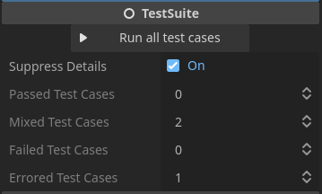
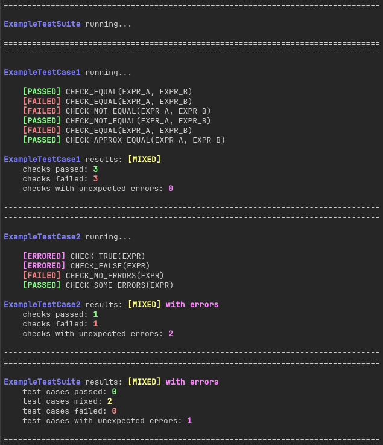
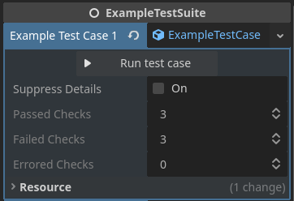
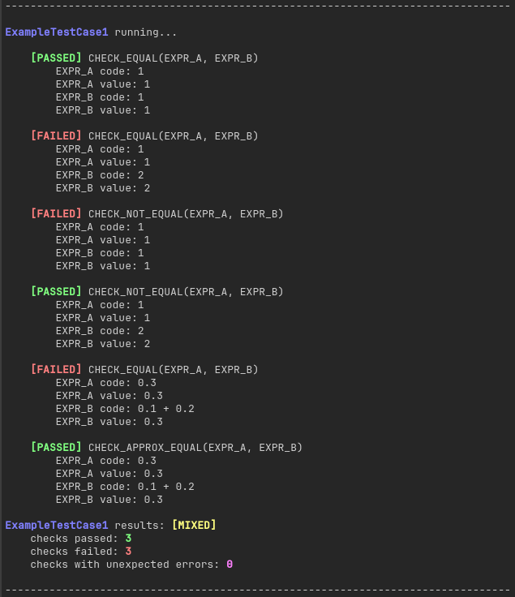

# GDExtension Testing

This is a simple testing library to use with C++ GDExtension projects.

There are already many C++ testing libraries available out there. However, I couldn't find any libraries for testing Godot-specific C++ code (i.e. anything using any of the Godot types, functions, etc., which depend on a running instance of Godot). So I created this library for use in one of my personal projects and thought I could share it with others as well.

Using this library, test suites and test cases can be written in C++. However, because of their dependence on Godot types, they must be compiled and run in the Godot editor, along with the GDExtension code that you are testing. I have an example test suite in this repo showing how this works. The C++ source code is at [src/example_test_suite.h](src/example_test_suite.h) and [src/example_test_suite.cpp](src/example_test_suite.cpp), and there is a scene using the example test suite at [example/example_test_suite.tscn](example/example_test_suite.tscn).

>   **Note:** I've only compiled for Linux so far. So if you're on another system, you'll first have to compile for your system to see this example working in the Godot editor.

The C++ source code for the testing library is in [src/testing](src/testing). To use this library in your own project, just copy these files into your GDExtension source code directory. Then create test suites and test cases as shown in the examples.

## Description of Elements

This testing library is made up of test suites, test cases, and checks. A test suite is a collection of test cases. And a test case is, at its most basic, just a function that runs some checks which can pass or fail.

### Test Suites

The `Testing::TestSuite` base class inherits from `Node`. All of your test suites should inherit from `Testing::TestSuite`. The basic structure of a test suite is as follows:

```cpp
// example_test_suite.h

#ifndef EXAMPLE_TEST_SUITE_H
#define EXAMPLE_TEST_SUITE_H

#include "testing/test_suite.h"

namespace godot
{
    class ExampleTestSuite : public Testing::TestSuite
    {
        GDCLASS(ExampleTestSuite, Testing::TestSuite)

    public:
        ExampleTestSuite();

        // Test case declarations...

    protected:
        static void _bind_methods();
    };
}

#endif
```

```cpp
// example_test_suite.cpp

#include "example_test_suite.h"

namespace godot
{
    ExampleTestSuite::ExampleTestSuite()
    {
        // Test case registrations...
    }

    void ExampleTestSuite::_bind_methods()
    {
        /// Test case bindings...
    }

    // Test case definitions...
}
```

To run a test suite, you will need to add it to a scene in the Godot editor. This means it first has to be registered as a type in your GDExtension's "register_types.cpp" file. For example:

```cpp
// In register_types.cpp

void initialize_gdext_testing_module(ModuleInitializationLevel p_level)
{
    if (p_level != MODULE_INITIALIZATION_LEVEL_SCENE)
        return;

    // Also make sure to register the base types
    GDREGISTER_ABSTRACT_CLASS(Testing::TestCase);
    GDREGISTER_CLASS(Testing::TestSuite);

    // Register your specific test suite
    GDREGISTER_CLASS(ExampleTestSuite);
}
```

Once added as a node in a scene, you should be able to see a few basic properties of the test suite in the "Inspector" dock:



In addition to these properties, you should also see each of your test cases in the "Inspector" as well. More on that in the next section.

Click "Run all test cases" to run the entire test suite. Some results from the test suite are shown in the "Inspector". More complete results will be printed to the console:



### Test Cases

The `Testing::TestCase` abstract class inherits from `Resource`. A single test suite has a set of test case resources. Each test case shows up in four locations in the test suite source code:

1.  **Declared in the test suite header file using `DECLARE_TEST_CASE`.** This defines the test case class (a subclass of `Testing::TestCase`) and creates the necessary member variables/functions for it to belong to the test suite.

    ```cpp
    DECLARE_TEST_CASE(ExampleTestCase1, example_test_case_1);
    ```

    >   **Note:**
    >   *   `ExampleTestCase1` is the name of the test case's class.
    >   *   `example_test_case_1` is the name of the property (belonging to the test suite) that refers to this test case. This property will be available from GDScript by that exact name. In C++, you can use `get_test_case_1()` and `set_test_case_1()`.

2.  **Registered in the test suite constructor using `REGISTER_TEST_CASE`.** This adds the test case to a list that the test suite can use to run through all of its test cases.

    ```cpp
    REGISTER_TEST_CASE(ExampleTestCase1, example_test_case_1);
    ```

3.  **Bound in the test suite `_bind_methods()` method using `BIND_TEST_CASE`.** This exposes the test case to Godot as a property of the test suite. It also registers the test case class with Godot.

    ```cpp
    BIND_TEST_CASE(ExampleTestSuite, ExampleTestCase1, example_test_case_1);
    ```

4.  **Defined in the test suite source file using `DEFINE_TEST_CASE`.** Among other things, this defines the actual body of the test case.

    ```cpp
    DEFINE_TEST_CASE(ExampleTestSuite, ExampleTestCase1, example_test_case_1)
    {
        // Test case body...
    }
    ```

If set up correctly, each test case will show up as an individual property in the "Inspector" for the test suite:



Click "Run test case" to run the individual test case. Some results from the test case are shown in the "Inspector". More complete results will be printed to the console:



### Checks

Each "check" is a macro statement that is evaluated within the body of a test case and can either pass, fail, or produce an error. The following check macros are provided:

1.  Manual checks
    *   `CHECK_PASS()`
    *   `CHECK_FAIL()`
    *   `CHECK_PASS_CUSTOM(COUNT, MESSAGE)`
    *   `CHECK_FAIL_CUSTOM(COUNT, MESSAGE)`

2.  Boolean checks
    *   `CHECK_TRUE(EXPR)`
    *   `CHECK_FALSE(EXPR)`

3.  Comparison checks
    *   `CHECK_EQUAL(EXPR_A, EXPR_B)`
    *   `CHECK_NOT_EQUAL(EXPR_A, EXPR_B)`
    *   `CHECK_LESS(EXPR_A, EXPR_B)`
    *   `CHECK_LESS_OR_EQUAL(EXPR_A, EXPR_B)`
    *   `CHECK_GREATER(EXPR_A, EXPR_B)`
    *   `CHECK_GREATER_OR_EQUAL(EXPR_A, EXPR_B)`
    *   `CHECK_APPROX_EQUAL(EXPR_A, EXPR_B)`

4.  Error checks
    *   `CHECK_NO_ERRORS(EXPR)`
    *   `CHECK_NO_PRINTERRS(EXPR)`
    *   `CHECK_NO_PUSH_ERRORS(EXPR)`
    *   `CHECK_NO_PUSH_WARNINGS(EXPR)`
    *   `CHECK_SOME_ERRORS(EXPR)`
    *   `CHECK_SOME_PRINTERRS(EXPR)`
    *   `CHECK_SOME_PUSH_ERRORS(EXPR)`
    *   `CHECK_SOME_PUSH_WARNINGS(EXPR)`
    *   `CHECK_N_ERRORS(EXPR, N)`
    *   `CHECK_N_PRINTERRS(EXPR, N)`
    *   `CHECK_N_PUSH_ERRORS(EXPR, N)`
    *   `CHECK_N_PUSH_WARNINGS(EXPR, N)`

    >   **Note:** Godot's philosophy regarding errors and exceptions is to never halt execution. Generally this means you don't throw exceptions. Instead, you return error codes or you print an error to the console and continue execution. You can test error codes with regular macros. But for errors printed to the console, I've provided the `ErrorHandler` class. If you use this class to print errors (instead of directly using `UtilityFunctions`), then it will keep track of the errors that have been printed, and those can be captured by the test macros.
